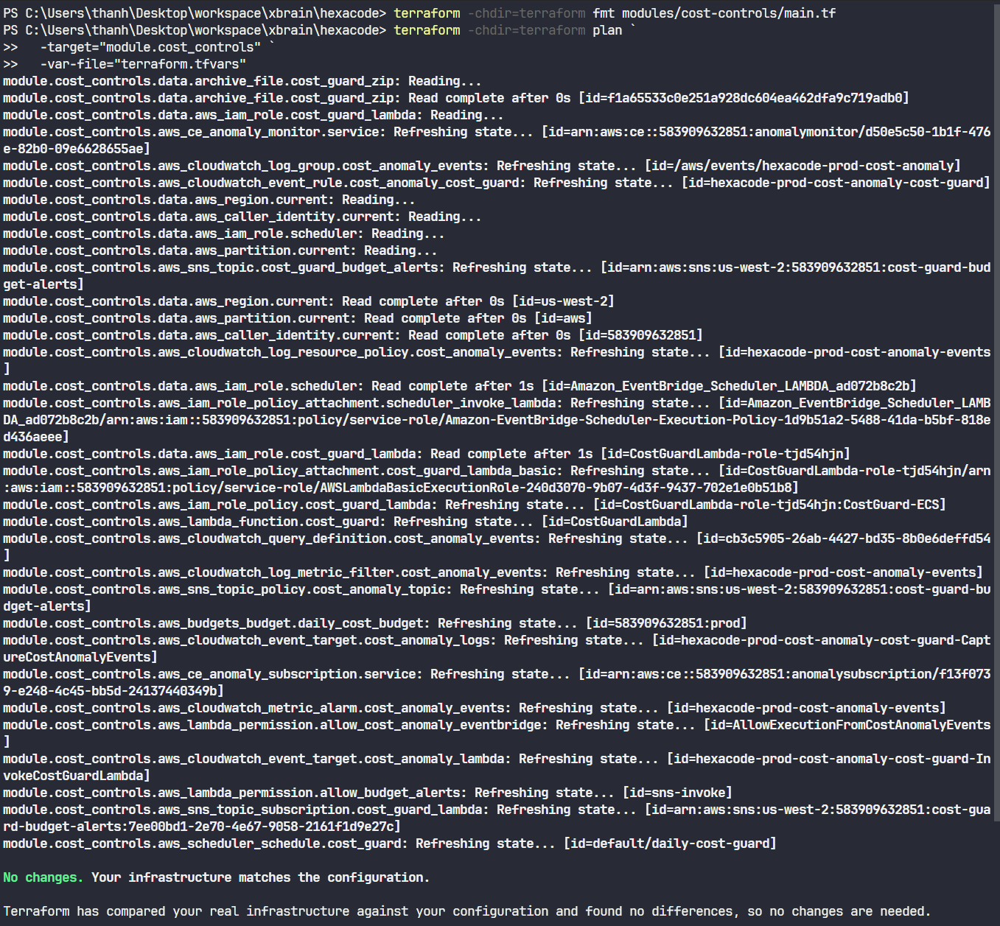
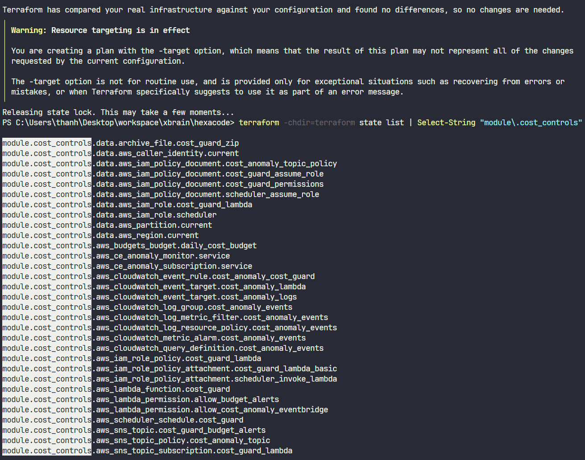

# Evidence Pack — W6: Operations Hardening & Cost-Aware Cloud
# Group 6 — HexaCode

---

## Section 1 — Cover

| Field | Details |
|---|---|
| **Group Number** | Group 6 |
| **Member Names** | Minh Tuấn · Thành Vinh · Anh Hoàng · Hoàng Nhân · Mạnh Khang · Ngọc Thắng · Hoàng Thông · Thành Tâm |
| **Link Repo** | `[GitHub repo URL]` |
| **W5 Evidence Pack** | `[Link tới docs/W5_evidence.md commit]` |

### W5 Feedback đã giải quyết

> Temporary guide — xoá block này sau khi đã thay bằng ảnh thật.
> - Mục này chỉ nên giữ các feedback đã có evidence trực quan từ AWS Console hoặc source-of-truth đủ mạnh.
> - Các feedback chưa đóng hoàn toàn vẫn để ở `docs/envidence_drift.md`, không claim ở đây.

#### 1.1 API Gateway throttling không còn giữ mức 1 RPS

> Temporary guide — xoá block này sau khi đã thay bằng ảnh thật.
> - AWS Console → **API Gateway** → **APIs** → HTTP API `5l48bwt6ck` → **Stages** → chọn stage đang deploy.
> - Chụp phần **Default route settings** để thấy throttling không còn là `1 request/giây`; theo source-of-truth hiện tại là `burst 200 / rate 100`.
> - Sau đó vào **Routes** → `POST /api/chat/messages` để chụp limit riêng cho chat route; theo source-of-truth hiện tại là `burst 20 / rate 10`.
> - Nếu console đang hiển thị khác hẳn, không dùng ảnh này để claim đã sửa hoàn toàn; đưa lại item vào `envidence_drift.md`.


<sub>Note: Live API Gateway throttling đã rời khỏi narrative cũ `1 request/giây`; có default throttling cho stage và route-level throttling riêng cho `POST /api/chat/messages`.</sub>

#### 1.2 Backup selection không còn mô tả kiểu assign-by-prefix

> Temporary guide — xoá block này sau khi đã thay bằng ảnh thật.
> - AWS Console → **AWS Backup** → **Backup plans** → mở plan `hexacode-prod-daily-backups` → **Resource assignments** / **Protected resources**.
> - Chụp sao cho thấy selection hiện tại bảo vệ **3 explicit real resources**:
>   - `hexacode-prod-db`
>   - EFS filesystem của app
>   - `hexacode-prod-problem-assets`
> - Nếu console không hiển thị đủ 3 resource trong cùng luồng bằng chứng, không claim feedback này đã đóng hoàn toàn.
> - `hexacode-prod-problem-assets` là resource thứ ba có chủ đích vì nó chứa problem statements và chatbot knowledge-base content đang được user dùng thật.
> - Đây là **bucket dùng cho backup evidence**; không nhầm với bucket security demo ở MH-SEC là `hexacode-prod-submission-artifacts`.


<sub>Note: Backup selection hiện đã là explicit resource assignment và đã đạt `>=3` resource thật theo hướng mentor yêu cầu; S3 bucket trong phần backup là `hexacode-prod-problem-assets`, tách biệt với bucket security demo ở MH-SEC.</sub>

#### 1.3 Provisioned concurrency đã có cấu hình live, nhưng phần diễn giải warm-start phải viết đúng

> Temporary guide — xoá block này sau khi đã thay bằng ảnh thật.
> - AWS Console → **Lambda** → function chat của app → **Configuration** → **Concurrency**.
> - Chụp phần **Reserved concurrency** và **Provisioned concurrency** để chứng minh hạ tầng đã có cấu hình, thay vì chỉ nói suông trong W5.
> - Ảnh này chỉ chứng minh **cấu hình tồn tại**; phần giải thích warm-start vẫn phải dựa trên log/init-duration đúng ngữ cảnh nếu muốn claim đã đóng hoàn toàn.
> - Vì vậy, nếu chỉ mới có ảnh config mà chưa có diễn giải/log tốt hơn, vẫn giữ item narrative này ở `envidence_drift.md`.


<sub>Note: Chat Lambda đã có reserved/provisioned concurrency config trên live AWS. Đây là evidence tốt hơn cho hạ tầng, nhưng chưa tự động thay thế cho một warm-start explanation đúng.</sub>

---

## Section 2 — MH-COST-V — Cost Visibility & Attribution

> Temporary guide — xoá block này sau khi đã thay bằng ảnh thật.
> - Phần mở đầu này dùng để chứng minh nhóm đã tiếp thu feedback W5 và sửa source-of-truth/operational posture trước khi sang W6.
> - Nếu mentor hỏi sâu, ưu tiên nói rõ điểm nào đã có **live AWS confirmation** và điểm nào mới dừng ở **Terraform/doc correction**.
> - Các mục chưa đóng hẳn đã được tách sang `docs/envidence_drift.md` để xử lý tiếp, không claim quá mức trong evidence pack chính.

### 2.1 Tagging — Bốn tag key bắt buộc trên curated evidence set

**Tag schema áp dụng cho bộ ảnh W6:**

| Tag Key | Giá trị | Quy tắc |
|---|---|---|
| `Owner` | `[group email]` | Dùng đúng value đã gắn trên bộ resource được chọn |
| `Environment` | `prod` | Không trộn `prod` và `production` |
| `CostCenter` | `G6` | Group ID |
| `Application` | `HexaCode` | Nhất quán — không đổi case |

> Temporary guide — xoá block này sau khi đã thay bằng ảnh thật.
> - `w6-tags-ec2.png`: AWS Console → **EC2** → **Instances** → chọn instance evidence đã chuẩn hoá tag → tab **Tags**. Chụp sao cho thấy **Name** + đủ 4 key `Owner`, `Environment=prod`, `CostCenter`, `Application`.
> - `w6-tags-rds.png`: AWS Console → **RDS** → **Databases** → chọn `hexacode-prod-db` → tab **Tags**. Chụp rõ tên DB và đủ 4 tag.
> - `w6-tags-lambda.png`: AWS Console → **Lambda** → chọn function evidence đã chuẩn hoá tag, ví dụ `CostGuardLambda` hoặc function W6 khác đã dùng trong curated set → tab **Configuration** / **Tags**.
> - `w6-tags-s3.png`: AWS Console → **S3** → chọn bucket evidence của app → tab **Properties** → **Tags**.
> - Bộ ảnh Section 2 chỉ cần claim trên **curated evidence set** đã được chuẩn hoá, không cần overclaim rằng toàn account đã đồng nhất hoàn toàn.

**Screenshot tag trên EC2 / ECS:**


<sub>Note: Cả 4 tag key hiển thị trên instance đã redeploy.</sub>

**Screenshot tag trên RDS:**


<sub>Note: Cả 4 tag key hiển thị trên RDS hexacode-prod-db.</sub>

**Screenshot tag trên Lambda:**


<sub>Note: Cả 4 tag key hiển thị trên Lambda functions đã redeploy.</sub>

**Screenshot tag trên S3:**


<sub>Note: Cả 4 tag key hiển thị trên S3 buckets của app.</sub>

---

### 2.2 Cost Allocation Tags — Activated trong Billing Console

> Temporary guide — xoá block này sau khi có ảnh thật.
> - AWS Console → **Billing and Cost Management** → **Cost allocation tags**.
> - Tìm các key `Owner` và `Application`, filter theo status nếu cần, rồi **Activate**.
> - Chụp màn hình khi thấy cột status là **Active** cho đúng 2 key này.
> - Theo drift audit, phiên read-only CLI **không verify được** bước này vì `ce list-cost-allocation-tags` bị `AccessDenied`, nên đây là mục bắt buộc phải xác nhận trực tiếp trong Billing Console chứ không suy ra từ tag trên resource.


<sub>Note: Tag `Owner` và `Application` đã được Activate trong AWS Billing console → Cost allocation tags. Đây là bước tách biệt khỏi việc tạo tag — bỏ qua bước này thì tag không xuất hiện như filter dimension trong Cost Explorer.</sub>

---

### 2.3 Cost Monitoring Tool(s) đã cấu hình

> Temporary guide — xoá block này sau khi có ảnh thật.
> - `w6-budgets-config.png`: AWS Console → **Billing** → **Budgets** → mở budget `prod`. Với evidence pack workshop, giữ narrative theo yêu cầu bài là **$150/tuần**; ảnh nên ưu tiên thể hiện ngưỡng, alert, và wiring hơn là tranh luận về period wording trong template.
> - `w6-cost-explorer-filter.png`: AWS Console → **Cost Explorer** → filter theo tag dimension của workload. Chỉ chụp khi `Application=HexaCode` đã xuất hiện làm filter; nếu chưa thấy, quay lại mục Cost allocation tags.
> - `w6-anomaly-detection.png`: AWS Console → **Cost Anomaly Detection** → monitor `Monitor-Hexacode`. Theo audit, monitor live đang là **SERVICE monitor**, threshold `$75`, subscription hằng ngày tới `nahoangit@gmail.com`.

**Tool 1 — AWS Budgets:**


<sub>Note: Budget $150/tuần được set trước Thứ Sáu. Alert gửi về email/SNS khi đạt các ngưỡng cấu hình. Với evidence pack workshop, giữ wording này nhất quán với narrative của bài.</sub>

**Tool 2 — Cost Explorer filter theo tag:**


<sub>Note: Cost Explorer filter theo `Application=HexaCode` — thấy chi phí breakdown theo service chỉ của workload nhóm, không phải toàn account.</sub>

**Tool 3 — Cost Anomaly Detection (nếu có):**


<sub>Note: Monitor scope về `Application=HexaCode`. Alert subscription được xác nhận.</sub>

---

### 2.4 Baseline Cost Breakdown (sau ít nhất 24h data)

> Temporary guide — xoá block này sau khi có ảnh thật.
> - AWS Console → **Cost Explorer** → chọn khoảng thời gian có ít nhất 24h dữ liệu sau redeploy.
> - Group by **Service** và filter theo tag workload của nhóm.
> - Ảnh nên hiển thị rõ phần breakdown để viết được đoạn “top 3 cost drivers”.
> - Theo drift audit, một số cost driver có khả năng nổi bật nếu chúng đang chạy thật: **RDS**, **Network Firewall / NAT-related surface**, **ECS/Fargate**, **CloudFront**, hoặc **Bedrock/OpenSearch**. Đừng điền ví dụ cứng nếu số thật trên Cost Explorer khác.


<sub>Note: Screenshot Cost Explorer sau 24h redeploy, filter theo tag `Application=HexaCode`.</sub>

> Temporary guide for paragraph — xoá sau khi viết observation thật.
> - Viết theo mẫu: `Top 3 cost drivers là A, B, C; A cao vì ..., B đáng chú ý vì ..., C có thể tối ưu bằng ...`.
> - Nếu nhóm đang chạy off-hours scaling thì nhớ đối chiếu với audit: live ECS services đã từng ở desired/running = 0 ngoài giờ, nên cost compute có thể thấp hơn dự đoán vào lúc chụp.

**Quan sát top 3 cost driver:**

`[Viết 1 paragraph ở đây. Ví dụ: "Top 3 cost driver sau 24h redeploy: (1) RDS db.m7i.large chiếm ~45% tổng chi phí ($X) — đang chạy Multi-AZ trong dev environment, có thể tắt Multi-AZ để cắt ~50% dòng RDS. (2) NAT Gateway data processing chiếm ~25% ($X) — Lambda chatbot gọi Bedrock qua NAT, có thể chuyển sang VPC endpoint để giảm. (3) ECS Fargate chiếm ~20% ($X) — 3 services chạy liên tục kể cả khi không có traffic, có thể scale down ngoài giờ."]`

---

### 2.5 Tagging Strategy Document (1 trang)

**Tag keys được dùng:**

| Key | Giá trị được phép | Bắt buộc trên |
|---|---|---|
| `Owner` | `[email cụ thể]` | Mọi billable resource |
| `Environment` | `dev` / `staging` / `prod` | Mọi billable resource |
| `CostCenter` | `G6` | Mọi billable resource |
| `Application` | `HexaCode` | Mọi billable resource |

**Enforce compliance thế nào:**

`[Mô tả cách nhóm đảm bảo tag nhất quán — ví dụ: dùng AWS Config rule `required-tags`, hoặc checklist deploy thủ công, hoặc tag policy trong AWS Organizations.]`

**Giá trị không được phép:**

- `Owner`: không dùng "N/A", "unknown", hoặc bỏ trống
- `Environment`: không dùng "Dev", "DEV", "development" — chỉ dùng "dev"
- `Application`: không dùng "hexacode", "HEXACODE" — chỉ dùng "HexaCode"

**Trong account thật (production):**

`[1-2 câu về cách enforce trong production — ví dụ: Service Control Policy deny CreateInstance nếu thiếu tag bắt buộc, hoặc AWS Config alert khi resource không có tag.]`

---

## Section 3 — MH-COST-A — Cost Control & Action

### 3.1 Automated Cost Guard Lambda

> Temporary guide — xoá block này sau khi có ảnh thật.
> - AWS Console → **Lambda** → tìm function `CostGuardLambda`.
> - Chụp phần **Overview** hoặc **Configuration** sao cho thấy function name, runtime, và **Last modified**. Theo drift audit, live function này đang active và last modified là `2026-05-21T09:25:59Z`.
> - Nếu nhóm đã tự sửa/clone function khác để đáp ứng rubric tốt hơn, hãy chụp function thực sự dùng cho demo thay vì mặc định bám `CostGuardLambda`.

**Mô tả:** Lambda function scan mọi EC2/RDS không được tag `keep=true` (hoặc `Environment=dev`) và stop chúng.

**Screenshot Lambda function:**


<sub>Note: Lambda function đã deploy, runtime Python, last modified timestamp.</sub>

**Lambda code snippet:**

```python
import boto3

ec2 = boto3.client('ec2')
rds = boto3.client('rds')

def handler(event, context):
    # Stop EC2 instances không có tag keep=true
    instances = ec2.describe_instances(
        Filters=[{'Name': 'instance-state-name', 'Values': ['running']}]
    )
    for reservation in instances['Reservations']:
        for instance in reservation['Instances']:
            tags = {t['Key']: t['Value'] for t in instance.get('Tags', [])}
            if tags.get('keep') != 'true':
                ec2.stop_instances(InstanceIds=[instance['InstanceId']])
                print(f"Stopped EC2: {instance['InstanceId']}")

    # Stop RDS instances không có tag keep=true
    dbs = rds.describe_db_instances()
    for db in dbs['DBInstances']:
        tags_resp = rds.list_tags_for_resource(ResourceName=db['DBInstanceArn'])
        tags = {t['Key']: t['Value'] for t in tags_resp['TagList']}
        if tags.get('keep') != 'true' and db['DBInstanceStatus'] == 'available':
            rds.stop_db_instance(DBInstanceIdentifier=db['DBInstanceIdentifier'])
            print(f"Stopped RDS: {db['DBInstanceIdentifier']}")
```

---

### 3.2 IAM Role — Least Privilege

> Temporary guide — xoá block này sau khi có ảnh thật.
> - Từ Lambda `CostGuardLambda` → tab **Configuration** → **Permissions** → click execution role.
> - Chụp 1 ảnh thể hiện trust relationship tới Lambda nếu cần, và 1 ảnh policy permissions gắn vào role.
> - Theo W6 spec, giảng viên cần thấy least-privilege reasoning; nếu policy đang rộng quá, ảnh này sẽ tự lộ điểm yếu.


<sub>Note: IAM execution role tập trung vào các permission cần cho cost-control flow (`ec2:DescribeInstances`, `ec2:StopInstances`, `rds:DescribeDBInstances`, `rds:ListTagsForResource`, `rds:StopDBInstance`). Nếu còn wildcard resource trong live policy thì mô tả đúng là "narrow action scope" thay vì overclaim full least-privilege.</sub>

### 3.3 EventBridge Daily Schedule

> Temporary guide — xoá block này sau khi có ảnh thật.
> - AWS Console → **EventBridge Scheduler** → mở schedule `daily-cost-guard`.
> - Theo drift audit, live schedule hiện là `cron(0 9 * * ? *)`, timezone `Asia/Ho_Chi_Minh`, target `CostGuardLambda`, trạng thái **Enabled**.
> - Chụp màn hình có đủ: schedule name, cron expression, timezone, target ARN/function.


<sub>Note: EventBridge Scheduler cron chạy daily invoke Cost Guard Lambda. Ảnh nên phản ánh đúng cron expression và timezone đang có trên live AWS.</sub>

---

### 3.4 Demonstrated Stop — Before/After + CloudTrail

> Temporary guide — xoá block này sau khi có ảnh thật.
> - Mục này chỉ đạt khi là **một resource thật** bị stop bởi Lambda.
> - Before/After: vào **EC2 → Instances** hoặc **RDS → Databases** rồi chụp cùng một resource ở trạng thái trước và sau.
> - CloudTrail: AWS Console → **CloudTrail** → **Event history** → filter `Event name = StopInstances` hoặc `StopDBInstance`.
> - Chụp sao cho thấy `eventTime`, `eventName`, resource ID, và identity/userAgent liên quan tới Lambda execution path.
> - Nếu chỉ có budget/SNS wiring mà chưa có ảnh resource bị stop thật thì MH-COST-A vẫn thiếu bằng chứng.


<sub>Note: EC2 instance (hoặc RDS) đang ở trạng thái Running trước khi Lambda chạy.</sub>

**After — Instance đã Stopped:**


<sub>Note: Cùng instance đã chuyển sang Stopped sau khi Cost Guard Lambda được invoke.</sub>

**CloudTrail event `StopInstances` / `StopDBInstance`:**


<sub>Note: CloudTrail event xác nhận Lambda đã gọi StopInstances/StopDBInstance — thấy eventName, eventTime, userAgent (Lambda role ARN), và instanceId bị stop.</sub>

---

### 3.5 Budgets daily $150 → SNS → Lambda (Wire + Demo)

> Temporary guide — xoá block này sau khi có ảnh thật.
> - AWS Console → **Billing** → **Budgets** → budget `prod` để chụp threshold/action notifications.
> - AWS Console → **SNS** → topic `cost-guard-budget-alerts` để chụp subscriptions/delivery path.
> - Nếu có thể, thêm ảnh Lambda trigger/subscription để nối mạch `Budget → SNS → Lambda`.
> - Theo drift audit, live AWS **không thấy native Budget Actions**, chỉ xác nhận budget-to-SNS-to-Lambda path. Vì vậy caption nên nói đúng là **SNS wiring**, đừng claim Budget Action nếu console chưa có.


<sub>Note: AWS Budgets daily budget → SNS topic được wire. Khi budget vượt ngưỡng, SNS publish message → Lambda được invoke.</sub>

**Test SNS publish — demonstrate chain:**

```bash
aws sns publish \
  --topic-arn arn:aws:sns:us-west-2:ACCOUNT_ID:cost-guard-topic \
  --message '{"AlarmName":"BudgetAlert","NewStateValue":"ALARM"}' \
  --region us-west-2
```


<sub>Note: Manual SNS publish trigger Lambda → Lambda stop một resource → xác nhận chain hoạt động end-to-end mà không cần chờ cost data thật.</sub>

---

### 3.6 Cost Data Latency — ADR

**Architecture Decision Record:**

**Context:** AWS cost data có độ trễ ~8–24 giờ trước khi xuất hiện trong Cost Explorer và Budgets. Trong một account workshop 48 giờ, cost-driven trigger từ Budgets gần như sẽ không fire vì data chưa kịp cập nhật.

**Decision:** Wire Budgets daily $150 → SNS → Lambda (đảm bảo chain tồn tại và test được), đồng thời dùng EventBridge Scheduler daily cron làm primary trigger đáng tin trong môi trường workshop.

**Consequences:** Trong production thật (account chạy nhiều tuần), Budgets cost-driven trigger sẽ fire bình thường sau 24h data. Chain đã được wire và test bằng SNS manual publish — behavior production đã được xác nhận.

---

## Section 4 — MH-OBS — CloudWatch Observability

### 4.1 CloudWatch Dashboard

> Temporary guide — xoá block này sau khi có ảnh thật.
> - AWS Console → **CloudWatch** → **Dashboards** → mở `HexaCode-Production-Observability`.
> - Ảnh nên thấy rõ backup-related widget đã được thêm vào dashboard, cùng các widget metric chuẩn khác đang có data.
> - Vì path backup-failure đã có datapoint thật, ưu tiên chụp widget liên quan `HexacodeBackupFailures` thay vì để placeholder generic.


<sub>Note: Dashboard `HexaCode-Production-Observability` có backup metric/alarm widget và các widget metric chuẩn khác. Widget backup dùng data thật từ failed restore verification.</sub>

### 4.2 Custom Metric — AWS Backup failure count

> Temporary guide — xoá block này sau khi có ảnh thật.
> - `w6-custom-metric.png`: CloudWatch → **Metrics** → namespace `HexaCode/Backup`.
> - Chụp metric `HexacodeBackupFailures` khi thấy datapoint thật.
> - Đây là metric được sinh từ CloudWatch Logs metric filter trên backup-failure event log group, không phải placeholder `PutMetricData` tự viết thêm.

**Metric đo gì:** số failed AWS Backup jobs đi qua log-based observability path của nhóm.

**Nguồn metric:**

```text
Log group: /aws/events/hexacode-prod-backup-failures
Metric namespace: HexaCode/Backup
Metric name: HexacodeBackupFailures
Filter logic: match failed backup/copy events via detail.state=FAILED and failed restore events via detail.status=FAILED
```


<sub>Note: Custom metric `HexacodeBackupFailures` trong namespace `HexaCode/Backup` — có datapoint thật từ failed restore verification jobs.</sub>

---

### 4.3 CloudWatch Alarm — Trạng thái ALARM

> Temporary guide — xoá block này sau khi có ảnh thật.
> - AWS Console → **CloudWatch** → **Alarms** → mở `hexacode-prod-backup-failures`.
> - `w6-alarm-config.png`: chụp detail để thấy metric `HexacodeBackupFailures`, threshold `>= 1`, evaluation period, và SNS action.
> - `w6-alarm-state.png`: chụp state hiện tại là **ALARM** sau failed restore verification. Không dùng `INSUFFICIENT_DATA`.


<sub>Note: Alarm `hexacode-prod-backup-failures` theo dõi metric `HexacodeBackupFailures`, threshold `>=1`, period 5 phút, action tới SNS topic backup failures.</sub>


<sub>Note: Alarm đã vào trạng thái `ALARM` sau khi nhóm tạo failed restore verification job thật.</sub>

---

### 4.4 Log Insights Query — Saved

> Temporary guide — xoá block này sau khi có ảnh thật.
> - AWS Console → **CloudWatch** → **Logs Insights**.
> - Chọn log group `/aws/events/hexacode-prod-backup-failures`.
> - `w6-log-insights-result.png`: chụp cùng lúc query text, log group name, và các dòng kết quả thật từ failed restore verification jobs.
> - `w6-log-insights-saved.png`: chụp danh sách **Saved queries** để thấy query `hexacode-prod-backup-failure-events` đã được lưu.

**Query text:**

```bash
fields @timestamp, detail.resourceArn, detail.state, detail.status, detail.backupVaultName, detail.backupJobId, detail.restoreJobId, detail.copyJobId
| sort @timestamp desc
| limit 20
```

**Log group chạy chống lại:** `/aws/events/hexacode-prod-backup-failures`


<sub>Note: Query trả về result rows thật từ failed restore verification jobs. Thấy rõ log group và query text trên màn hình.</sub>


<sub>Note: Saved query `hexacode-prod-backup-failure-events` nhìn thấy trong CloudWatch → Logs Insights → Saved queries.</sub>

---

## Section 5 — MH-SEC — Self-Healing Security Guard

### 5.1 Security Guard Lambda

> Temporary guide — xoá block này sau khi có ảnh thật.
> - Path demo chính đã chốt là `S3 public -> PutBucketPublicAccessBlock`.
> - Bucket của **security demo** là `hexacode-prod-submission-artifacts`.
> - AWS Console → **Lambda** → chọn function `hexacode-prod-security-guard` → chụp function name, runtime, environment variable `TARGET_BUCKET`, và last modified.
> - Theo W6 spec, điểm nằm ở detect→fix loop có thật; vì vậy ảnh function chỉ là phần mở đầu, phải đi kèm before/after và CloudTrail remediation evidence.
> - Đây là **bucket dùng cho MH-SEC evidence**; không nhầm với bucket backup ở phần W5 feedback là `hexacode-prod-problem-assets`.

**Misconfiguration detect và fix:** S3 bucket `hexacode-prod-submission-artifacts` bị tắt Block Public Access → Lambda gọi `PutBucketPublicAccessBlock` để bật lại toàn bộ 4 BPA flags.

**Screenshot Lambda function:**


<sub>Note: Lambda `hexacode-prod-security-guard` đã deploy với least-privilege IAM role và target bucket rõ ràng cho demo.</sub>

**Lambda code snippet:**

```python
import os
import boto3
from botocore.exceptions import ClientError

s3 = boto3.client("s3")
TARGET_BUCKET = os.environ["TARGET_BUCKET"]
EXPECTED = {
    "BlockPublicAcls": True,
    "IgnorePublicAcls": True,
    "BlockPublicPolicy": True,
    "RestrictPublicBuckets": True,
}

def handler(event, context):
    bucket = event.get("bucket") or TARGET_BUCKET
    before = None
    try:
        before = s3.get_public_access_block(Bucket=bucket)["PublicAccessBlockConfiguration"]
    except ClientError as exc:
        code = exc.response.get("Error", {}).get("Code")
        if code != "NoSuchPublicAccessBlockConfiguration":
            raise

    changed = before != EXPECTED
    if changed:
        s3.put_public_access_block(Bucket=bucket, PublicAccessBlockConfiguration=EXPECTED)

    after = s3.get_public_access_block(Bucket=bucket)["PublicAccessBlockConfiguration"]
    return {"bucket": bucket, "changed": changed, "before": before, "after": after}
```

---

### 5.2 IAM Role — Least Privilege

> Temporary guide — xoá block này sau khi có ảnh thật.
> - Từ function Security Guard → **Configuration** → **Permissions** → click execution role.
> - Nếu chọn path S3, ảnh policy nên lộ rõ các quyền như `s3:PutPublicAccessBlock` và các quyền read tối thiểu liên quan.
> - Nếu chọn path SG, ảnh policy nên lộ rõ `ec2:RevokeSecurityGroupIngress` + quyền describe cần thiết.


<sub>Note: IAM execution role của `hexacode-prod-security-guard` chỉ cần quyền đọc/trị liệu BPA cho bucket demo (`s3:GetBucketPublicAccessBlock`, `s3:PutBucketPublicAccessBlock`) cùng CloudWatch Logs permissions.</sub>

---

### 5.3 Trigger / Invocation Path

> Temporary guide — xoá block này sau khi có ảnh thật.
> - Trong live verification pass, nhóm dùng **manual invoke** để tạo một demo deterministic và an toàn.
> - Nếu sau đó nhóm bổ sung EventBridge rule hoặc scheduler cho Security Guard thì mới thay subsection này bằng ảnh trigger config thật.
> - Nếu chưa có trigger resource riêng cho security path, đừng overclaim EventBridge automation ở đây; caption phải nói đúng là manual invoke demo.

**Trigger type đã dùng cho evidence:** `[x] Manual invoke for deterministic demo` &nbsp;&nbsp; `[ ] EventBridge rule` &nbsp;&nbsp; `[ ] EventBridge Scheduler`


<sub>Note: Với evidence pass này, remediation được chứng minh bằng manual invoke vào `hexacode-prod-security-guard` để tạo before/after và CloudTrail proof một cách deterministic.</sub>

---

### 5.4 Demo Vòng Lặp Detect → Fix

> Temporary guide — xoá block này sau khi có ảnh thật.
> - `w6-sec-before.png`: chụp bucket `hexacode-prod-submission-artifacts` ở trạng thái **insecure** ngay sau khi cố ý tắt 4 Block Public Access flags.
> - `w6-sec-after.png`: chụp cùng bucket sau khi Lambda `hexacode-prod-security-guard` đã remediate.
> - `w6-cloudtrail-remediation.png`: AWS Console → **CloudTrail** → **Event history** → filter `PutBucketPublicAccessBlock`.
> - Ảnh CloudTrail nên cho thấy eventName, eventTime, bucket liên quan, và principal là execution role của Lambda.
> - Bucket demo đã được chọn để vòng lặp detect→fix dễ giải thích và rollback an toàn sau demo.

**Before — Vi phạm được tạo cố ý:**


<sub>Note: Bucket `hexacode-prod-submission-artifacts` bị tắt 4 Block Public Access flags. Đây là trạng thái insecure trước khi Lambda chạy.</sub>

**After — Lambda đã fix:**


<sub>Note: Cùng bucket sau khi Lambda remediate — cả 4 Block Public Access flags đã bật lại.</sub>

**CloudTrail event của lần gọi fix API:**


<sub>Note: CloudTrail event `PutBucketPublicAccessBlock` cho thấy remediation đã thực sự chạy từ execution role của `hexacode-prod-security-guard`.</sub>

---

### 5.5 Supporting Preventive Control

> Temporary guide — xoá block này sau khi có ảnh thật.
> - Supporting control giữ lại trong evidence pack là **S3 Block Public Access account-level** để cùng họ kiểm soát với path detect→fix đã chọn.
> - AWS Console → **S3** → **Block Public Access settings for this account**.
> - `w6-s3-bpa-account.png`: chụp cả 4 toggle ON.
> - Nếu có thêm bucket policy deny non-TLS hoặc deny unencrypted PutObject thì có thể dùng như supporting screenshot phụ, nhưng không cần giữ các path KMS hay Access Analyzer nữa.

**Supporting control đã giữ lại:** `S3 Block Public Access account-level`


<sub>Note: S3 console → Block Public Access settings for this account → cả 4 setting đều ON. Đây là preventive control bổ sung cho cùng họ S3, tách với remediation demo dùng bucket `hexacode-prod-submission-artifacts`.</sub>

---

### 5.6 Security Threat Statement

> Temporary guide — xoá block này sau khi viết xong.
> - Viết theo cấu trúc: `misconfiguration là gì -> data/asset nào bị ảnh hưởng -> attacker có thể làm gì`.
> - Tránh viết chung chung kiểu “bị hack”; rubric muốn thấy blast radius cụ thể.

**Guard fix misconfiguration gì:**
`[e.g. "S3 bucket chứa Bedrock KB documents bị set public — mọi người trên internet có thể đọc toàn bộ nội dung knowledge base của app."]`

**Blast radius nếu không remediate:**
`[e.g. "Toàn bộ 36 markdown documents của GeekBrain — bao gồm incident postmortems, SLA targets, team structure — bị lộ công khai. Kẻ tấn công có thể dùng thông tin này để social engineer hoặc target specific vulnerabilities."]`

---

### 5.7 Security-Cost Trade-off Statement

> Temporary guide — xoá block này sau khi viết xong.
> - Nêu **chi phí cụ thể** của control đã chọn, hoặc nói rõ là gần như zero-cost nếu chọn account-level BPA / deny policy.
> - Sau đó giải thích vì sao chi phí đó đáng trả so với blast radius ở trên.

`[1-2 câu nêu tên cost cụ thể và justification. Ví dụ: "KMS CMK tốn $1/tháng per key. Justified vì mỗi decrypt event được log kèm IAM principal — đây là audit trail bắt buộc khi data store chứa thông tin thi cử của người dùng. Cost $1/tháng nhỏ hơn nhiều so với rủi ro compliance khi không có audit trail."]`

---

## Section 6 — Project Recap

### Ứng dụng là gì

`[Mô tả ngắn: HexaCode là một coding practice platform cho phép người dùng luyện tập bài tập lập trình, nộp bài, và nhận hỗ trợ từ AI chatbot.]`

### Business Domain

`[e.g. EdTech / Competitive Programming / Online Judge]`

### Các quyết định kiến trúc và thiết kế chính từ W1-W5

| Tuần | Quyết định chính |
|---|---|
| W1 | `[e.g. 3-tier architecture: CloudFront → API Gateway → ECS Fargate → RDS]` |
| W2 | `[e.g. S3 cho static assets, IAM baseline với MFA trên root]` |
| W3 | `[e.g. RDS PostgreSQL / relational vì data có JOIN phức tạp giữa users-submissions-problems]` |
| W4 | `[e.g. Bedrock Agent với Knowledge Base, Lambda orchestrator, Hybrid Search K=10]` |
| W5 | `[e.g. VPC Peering Production↔Management, Network Firewall với domain allowlist, EFS mount, API Gateway + auth]` |
| W6 | `[e.g. Cost tagging discipline, automated cost guard, CloudWatch observability, self-healing security]` |

---

## Bonus *(Tuỳ chọn)*

### B1 Cost Anomaly Automation

**Screenshot 1 — Cost Anomaly Detection monitor:**


<sub>Note: Monitor `Monitor-Hexacode` đang theo dõi workload live. Ảnh nên thấy monitor name và monitor type/dimension hiện có trên account.</sub>

**Screenshot 2 — Anomaly subscription:**


<sub>Note: Subscription `Finance Team`, frequency hằng ngày, threshold tuyệt đối `$75`, recipient email đã confirm.</sub>

**Screenshot 3 — EventBridge rule:**


<sub>Note: EventBridge rule live `hexacode-prod-cost-anomaly-cost-guard` ở `us-west-2`, pattern `source = aws.ce`, `detail-type = Anomaly Detected`, filter theo `monitorName = Monitor-Hexacode`.</sub>

**Screenshot 4 — Lambda target / permission:**


<sub>Note: Rule target là `CostGuardLambda`; Lambda resource policy cho phép `events.amazonaws.com` invoke từ đúng rule ARN.</sub>

---

### B2 Terraform Bonus Guide cho resource W6

**GitHub source links:**
- Root wiring: [`terraform/main.tf`](https://github.com/pho-veteran/hexacode/blob/41ba6dcd00e49d1d550c90d1b4216ca122a01df1/terraform/main.tf)
- Cost controls module: [`terraform/modules/cost-controls/main.tf`](https://github.com/pho-veteran/hexacode/blob/41ba6dcd00e49d1d550c90d1b4216ca122a01df1/terraform/modules/cost-controls/main.tf)
- Lambda source: [`terraform/modules/cost-controls/cost_guard.py`](https://github.com/pho-veteran/hexacode/blob/41ba6dcd00e49d1d550c90d1b4216ca122a01df1/terraform/modules/cost-controls/cost_guard.py)

**Terraform code snippet dùng trực tiếp trong repo:**

```hcl
module "cost_controls" {
  source = "./modules/cost-controls"

  environment               = var.environment
  region                    = var.region
  budget_name               = var.cost_controls.budget_name
  budget_limit_amount_usd   = var.cost_controls.budget_limit_amount_usd
  alert_email               = var.cost_controls.alert_email
  sns_topic_name            = var.cost_controls.sns_topic_name
  lambda_name               = var.cost_controls.lambda_name
  lambda_role_name          = var.cost_controls.lambda_role_name
  lambda_basic_policy_arn   = var.cost_controls.lambda_basic_policy_arn
  schedule_name             = var.cost_controls.schedule_name
  scheduler_role_name       = var.cost_controls.scheduler_role_name
  scheduler_policy_arn      = var.cost_controls.scheduler_policy_arn
  schedule_expression       = var.cost_controls.schedule_expression
  schedule_timezone         = var.cost_controls.schedule_timezone
  anomaly_monitor_name      = var.cost_controls.anomaly_monitor_name
  anomaly_subscription_name = var.cost_controls.anomaly_subscription_name
  anomaly_threshold_usd     = var.cost_controls.anomaly_threshold_usd
}

resource "aws_cloudwatch_event_rule" "cost_anomaly_cost_guard" {
  name = "hexacode-${var.environment}-cost-anomaly-cost-guard"

  event_pattern = jsonencode({
    source        = ["aws.ce"]
    "detail-type" = ["Anomaly Detected"]
    detail = {
      monitorName = [var.anomaly_monitor_name]
    }
  })
}

resource "aws_cloudwatch_log_group" "cost_anomaly_events" {
  name              = "/aws/events/hexacode-${var.environment}-cost-anomaly"
  retention_in_days = 14
}

resource "aws_cloudwatch_event_target" "cost_anomaly_logs" {
  rule      = aws_cloudwatch_event_rule.cost_anomaly_cost_guard.name
  arn       = aws_cloudwatch_log_group.cost_anomaly_events.arn
  target_id = "CaptureCostAnomalyEvents"
}
```

<sub>Trích từ source Terraform thật trong `terraform/main.tf` và `terraform/modules/cost-controls/main.tf`, thể hiện phần nối module `cost_controls` và đường đi anomaly từ EventBridge sang CloudWatch Logs.</sub>


<sub>Terminal PowerShell chạy `terraform -chdir=terraform plan -target="module.cost_controls" -var-file="terraform.tfvars"` để chứng minh Terraform đang đọc đúng slice hạ tầng W6 và cho ra plan sạch phục vụ evidence capture.</sub>


<sub>Terminal PowerShell chứng minh artifact live tương ứng đã tồn tại trên AWS, dùng các lệnh như `aws events list-targets-by-rule`, `aws logs describe-log-groups`, hoặc `aws cloudwatch describe-alarms` cho path cost anomaly.</sub>

---

*— End of W6 Evidence Pack —*